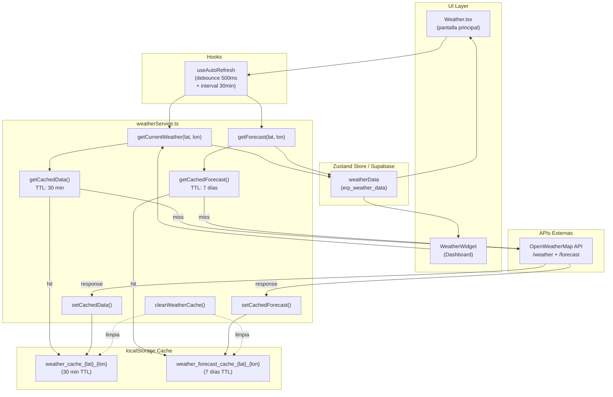
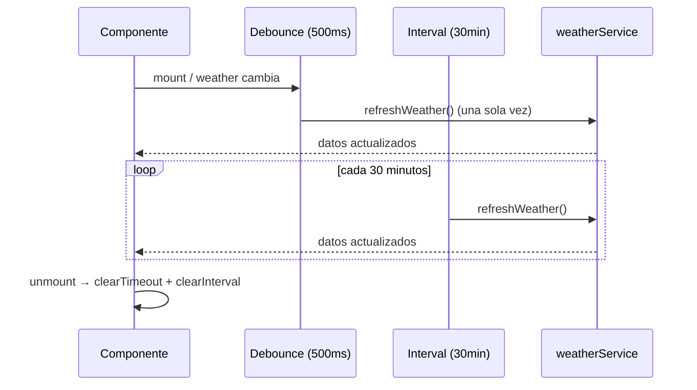
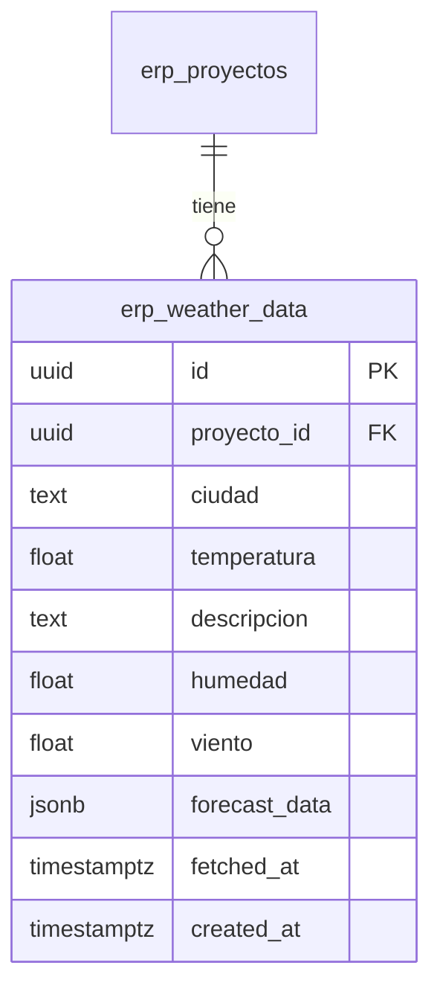

# Diagrama de Arquitectura — Módulo Weather

## Flujo de datos

## Estrategia de caché

| Tipo de dato | Clave localStorage | TTL | Estrategia |
|---|---|---|---|
| Clima actual | `weather_cache_{lat}_{lon}` | 30 minutos | Cache-first → API si expirado |
| Pronóstico 7 días | `weather_forecast_cache_{lat}_{lon}` | 7 días | Cache-first → API si expirado |

## Auto-refresh

## Persistencia Supabase

## Archivos del módulo

| Archivo | Responsabilidad |
|---|---|
| `src/erp/screens/Weather.tsx` | Pantalla principal, UI, auto-refresh |
| `src/erp/services/weatherService.ts` | Lógica de fetch, caché, normalización |
| `src/erp/components/WeatherWidget.tsx` | Widget compacto para Dashboard |
| `supabase/migrations/*_weather*.sql` | Schema de persistencia |

*Última actualización: 2026-07-12*
